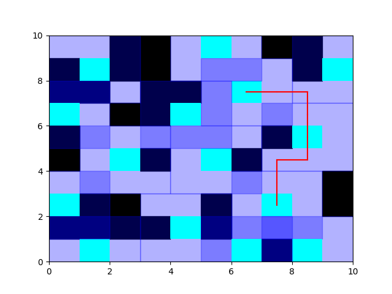
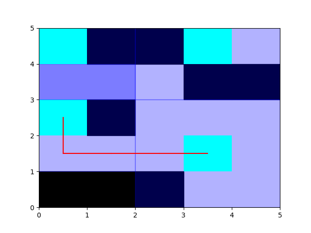
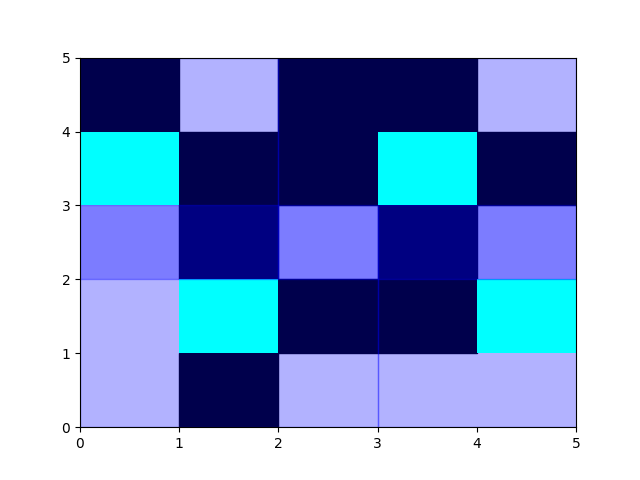

# CityGrid с Надежностью Пути

## Введение
CityGrid представляет собой сетку города, где некоторые блоки могут быть затруднены для покрытия башнями. Суть задачи - эффективно разместить башни так, чтобы покрыть все незатрудненные блоки.

## Основные классы

### CityGrid

### Общий подход

Создайте экземпляр CityWithReliability с указанием размеров города.
Оптимизируйте размещение башен для покрытия всех незатрудненных блоков.
Выберите две башни для поиска наиболее надежного пути.
Найдите и визуализируйте надежный путь между выбранными башнями.
### Примечание

Все методы и атрибуты, унаследованные от CityGrid, также доступны в CityWithReliability. В случае невозможности построения надежного пути между башнями, будет выведено сообщение об ошибке.

### Заключение

CityWithReliability предоставляет инструменты для оптимизации размещения башен и нахождения наиболее надежного пути между башнями в городе с затрудненными блоками.

